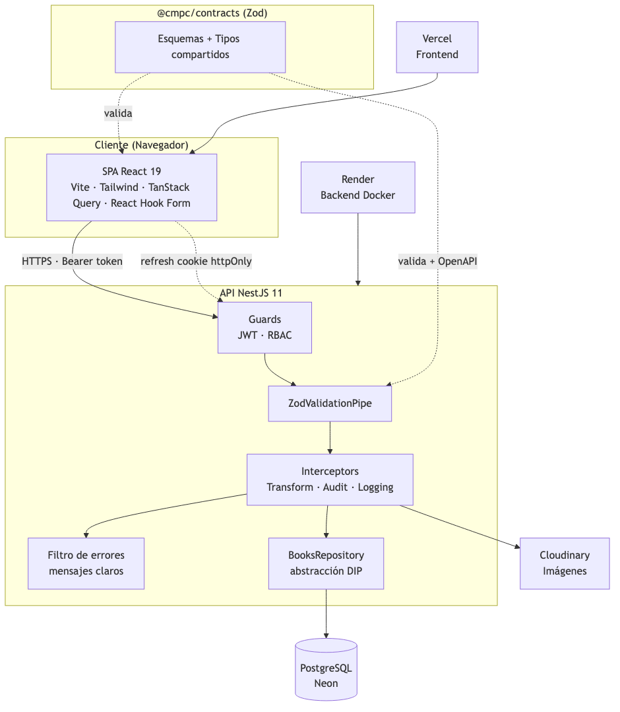
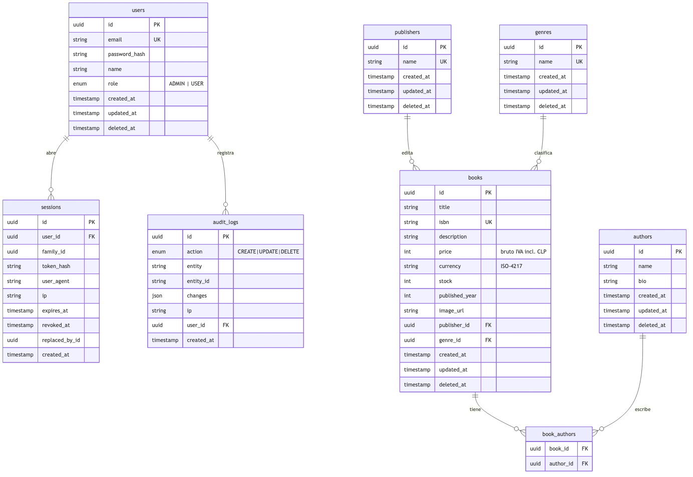

# CMPC Libros

Aplicación full-stack para la gestión de un catálogo de libros: autenticación, listado con
filtros avanzados, ordenamiento y paginación del lado del servidor, búsqueda en tiempo real,
alta/edición con carga de imágenes, exportación CSV, soft delete y auditoría de operaciones.

Construida como **monorepo** con tipos y validaciones compartidas entre el backend y el frontend.

---

## Stack

| Capa | Tecnologías |
|------|-------------|
| **Frontend** | React 19 · Vite · TypeScript · Tailwind CSS · TanStack Query · React Hook Form · Zod |
| **Backend** | NestJS 11 · TypeScript · Prisma 7 (driver adapter) · Passport-JWT · nestjs-zod · Swagger |
| **Base de datos** | PostgreSQL |
| **Contratos** | Paquete compartido `@cmpc/contracts` (esquemas Zod + tipos) usado por ambos lados |
| **Testing** | Jest (API) · Vitest + Testing Library + MSW (web) — cobertura ≥ 80% |
| **Infraestructura** | Docker multi-stage · Docker Compose · Nginx · pnpm workspaces |

## Estructura

```
cmpc/
├─ apps/
│  ├─ api/         # API NestJS (Prisma, auth, books, audit, catálogo)
│  └─ web/         # SPA React (auth, listado, formulario, detalle)
├─ packages/
│  └─ contracts/   # Esquemas Zod y tipos compartidos (única fuente de validación)
├─ docs/           # Arquitectura (Mermaid), modelo ER (DBML), ADRs
├─ docker-compose.yml
└─ render.yaml
```

---

## Arranque rápido con Docker

Requisitos: Docker y Docker Compose.

```bash
docker compose up --build
```

- **Aplicación:** http://localhost:8082
- **API + Swagger:** http://localhost:3002/api/docs
- **PostgreSQL:** localhost:5435

Las migraciones y los datos de ejemplo se cargan automáticamente al iniciar.

### Cuentas de ejemplo

| Rol | Correo | Contraseña |
|-----|--------|-----------|
| Administrador | `admin@cmpc.cl` | `Admin123!` |
| Usuario | `usuario@cmpc.cl` | `User123!` |

El administrador puede crear, editar y eliminar; el usuario solo consulta.

---

## Arranque en desarrollo

Requisitos: Node ≥ 20, pnpm ≥ 9 y una base PostgreSQL.

```bash
pnpm install
cp .env.example .env          # ajusta la conexión y los secretos

pnpm db:migrate               # aplica migraciones
pnpm db:seed                  # carga datos de ejemplo

pnpm dev                      # API (3002) + frontend (5174)
```

- Frontend: http://localhost:5174
- API + Swagger: http://localhost:3002/api/docs

---

## Variables de entorno

Ver `.env.example`. Principales:

| Variable | Descripción |
|----------|-------------|
| `DATABASE_URL` / `DIRECT_URL` | Conexión a PostgreSQL |
| `JWT_ACCESS_SECRET` / `JWT_REFRESH_SECRET` | Secretos de firma de tokens |
| `JWT_ACCESS_TTL` / `JWT_REFRESH_TTL` | Vigencia de los tokens |
| `CORS_ORIGIN` | Origen permitido del frontend |
| `CLOUDINARY_*` | Credenciales para la carga de imágenes (opcional) |
| `VITE_API_URL` | URL de la API que consume el frontend |

---

## Scripts

| Comando | Acción |
|---------|--------|
| `pnpm dev` | API + frontend en paralelo |
| `pnpm build` | Compila todo el monorepo |
| `pnpm test` / `pnpm test:cov` | Tests (con cobertura) |
| `pnpm db:migrate` / `db:seed` / `db:studio` | Tareas de base de datos |

---

## API

Documentación interactiva **Swagger/OpenAPI** en `/api/docs`. Endpoints principales:

```
POST /api/auth/login | register | refresh | logout      GET /api/auth/me
GET  /api/books        # filtros, orden, paginación y búsqueda
POST /api/books        PATCH/DELETE /api/books/:id        GET /api/books/:id
GET  /api/books/export # CSV
POST /api/books/:id/image
GET  /api/authors | /api/publishers | /api/genres
GET  /api/analytics/summary  # métricas del inventario (panel de analítica)
GET  /api/audit        # bitácora (solo administradores)
GET  /api/health
```

El **panel de analítica** (`/dashboard` en la app) muestra KPIs del inventario (total de libros,
disponibles/agotados, valor del inventario, stock) y la distribución por género, editorial y autores.

Respuesta uniforme: `{ success, data, meta? }`. Errores: `{ success, error: { message, code, fields? } }`
con mensajes claros para el usuario.

---

## Testing

```bash
pnpm test:cov    # build de contratos + tests de los tres paquetes
```

> `@cmpc/web` importa tipos desde el `dist/` del paquete de contratos.
> El script `test:cov` hace el build automáticamente antes de correr las suites.

| Paquete | Framework | Tests | Cobertura |
|---------|-----------|-------|-----------|
| `apps/api` | Jest (unit + e2e con Postgres real) | 118 | ~95 % |
| `apps/web` | Vitest + Testing Library + MSW | 45 | ~90 % |
| `packages/contracts` | Vitest | 32 | 100 % |

Los tests de contratos validan los esquemas Zod compartidos (ISBN, política de contraseña,
coerción de query params, etc.) — la misma lógica que usan el backend y el frontend.

---

## Documentación

### Diagrama de arquitectura



### Modelo relacional (ER)



- **Arquitectura detallada:** [`docs/architecture.md`](docs/architecture.md) — diagramas Mermaid
  (componentes, flujo de petición, autenticación y modelo ER) renderizados automáticamente por GitHub.
- **Modelo relacional (DBML):** [`docs/database.dbml`](docs/database.dbml) — importable en
  [dbdiagram.io](https://dbdiagram.io) para exploración interactiva.
- **Decisiones de arquitectura (ADR):** [`docs/adr/`](docs/adr) — 8 ADRs que documentan las
  decisiones técnicas clave (monorepo, auth, monetario, despliegue, etc.).
- **API interactiva:** Swagger/OpenAPI en `/api/docs` (deshabilitado en producción).

---

## Despliegue

- **Frontend → Vercel** (SPA estática; `apps/web/vercel.json` configura el rewrite).
- **Backend → Render** (Docker; `render.yaml`). Health check en `/api/health`.
- **Base de datos → PostgreSQL gestionado** (p. ej. Neon): `DATABASE_URL` (pooled) y `DIRECT_URL` (directa).
- **Imágenes → Cloudinary**.

El proyecto sigue la metodología **Twelve-Factor App**: configuración por entorno, procesos sin
estado, backing services conectables, logs como flujo de eventos, apagado elegante y separación
estricta de las etapas de construcción y ejecución.
