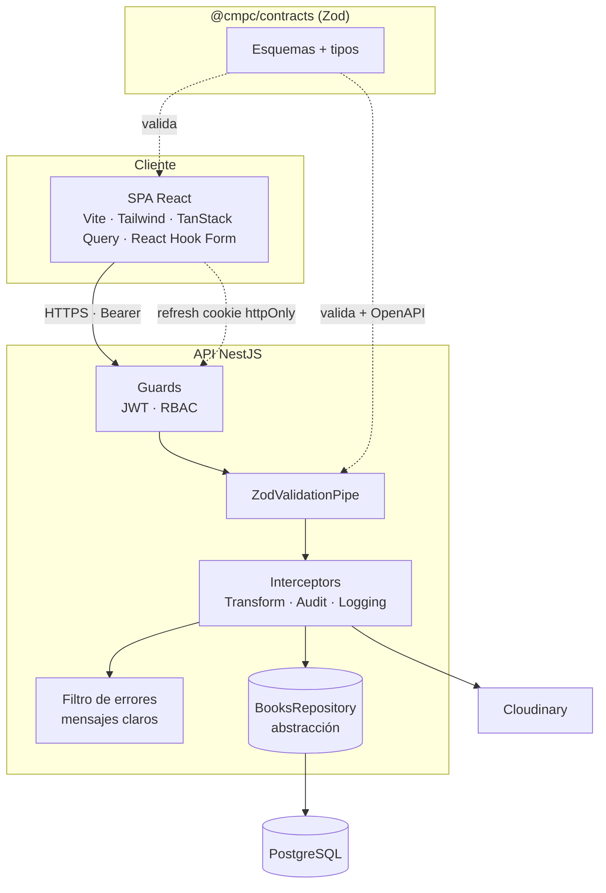
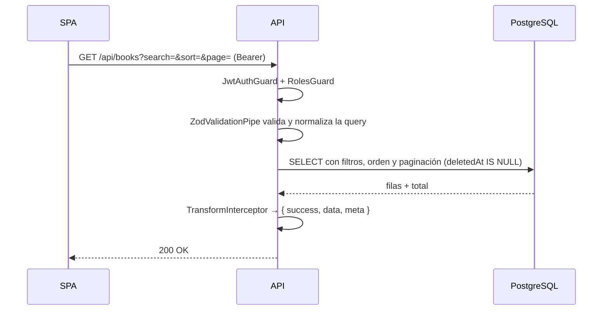
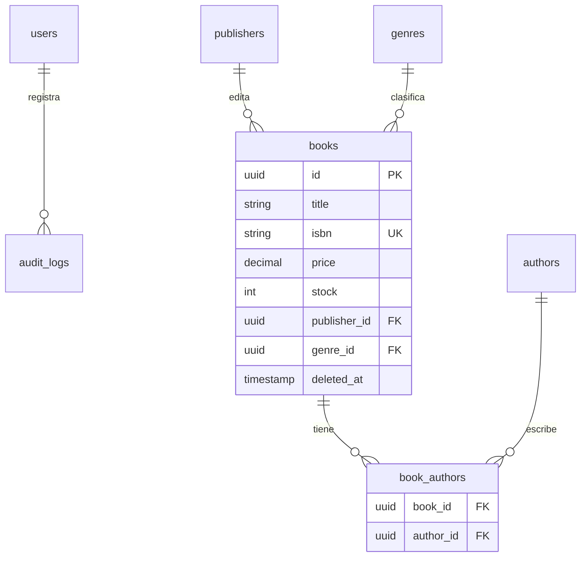

# Arquitectura — CMPC Libros

## Visión general

Sistema desacoplado: una SPA React consume una API REST NestJS que persiste en PostgreSQL
mediante Prisma. El paquete `@cmpc/contracts` define los esquemas de validación y los tipos,
y es consumido tanto por el backend (validación + OpenAPI) como por el frontend (formularios),
garantizando una única fuente de verdad.

## Flujo de una petición de listado

## Autenticación (JWT con rotación de refresh)

- **Access token** (15 min) en memoria del cliente → mitiga XSS.
- **Refresh token** (7 días) en cookie `httpOnly`, con su hash almacenado en la base de datos.
- **RBAC**: las operaciones de escritura requieren rol `ADMIN` (`RolesGuard` + `@Roles`).

## Capas del backend (SOLID)

- **Controllers** — orquestan HTTP y documentan en Swagger.
- **Services** — lógica de negocio. `BooksService` depende de la interfaz `BooksRepository`
  (inversión de dependencias), no de Prisma.
- **Repository** — `PrismaBooksRepository` encapsula consultas y **transacciones** (sincroniza
  la tabla puente `book_authors` de forma atómica).
- **Transversal** — filtro de errores (mensajes claros), interceptores (transformación de
  respuesta, auditoría, logging) y guards globales.

## Manejo de errores

Toda excepción se traduce a una respuesta uniforme con mensajes en lenguaje simple. Los errores
de validación incluyen el detalle por campo (`fields`), que el frontend muestra junto a cada
input. Los errores técnicos (base de datos, fallos internos) nunca se exponen al usuario.

## Modelo de datos

7 tablas normalizadas a BCNF, con restricciones de integridad (`CHECK`) a nivel de base de datos
y la disponibilidad derivada del stock. Ver [`database.dbml`](database.dbml).

## Despliegue

| Componente | Plataforma |
|-----------|------------|
| Frontend (estático) | Vercel |
| Backend (Docker) | Render |
| Base de datos | PostgreSQL gestionado (Neon) |
| Imágenes | Cloudinary |

El sistema sigue la metodología Twelve-Factor; ver [`adr/0006-twelve-factor.md`](adr/0006-twelve-factor.md).
